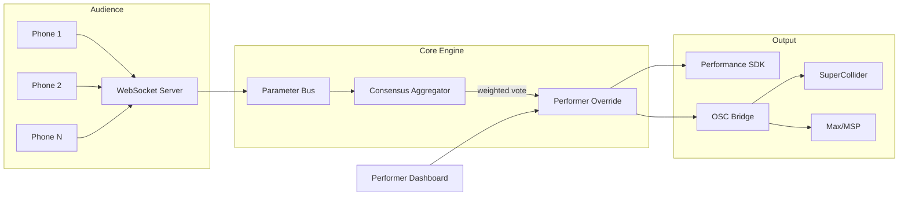

# Omni-Dromenon Engine (metasystem-master)

[](https://github.com/organvm-ii-poiesis)
[](LICENSE)
[](tsconfig.base.json)
[](packages/orchestrate)
[](pnpm-workspace.yaml)
[]()

> A real-time audience-participatory performance engine where collective audience input shapes live art through weighted consensus algorithms — while performers retain expressive override authority.

[Artistic Purpose](#artistic-purpose) | [Conceptual Approach](#conceptual-approach) | [Technical Overview](#technical-overview) | [Installation](#installation) | [Quick Start](#quick-start) | [Working Examples](#working-examples) | [Theory Implemented](#theory-implemented) | [Portfolio & Exhibition](#portfolio--exhibition) | [Cross-References](#cross-references) | [Contributing](#contributing) | [License & Author](#license--author)

---

## Artistic Purpose

Live performance has always been a negotiation between performers and audiences. Applause, silence, laughter, restlessness — these are the audience's instruments, and performers have always read them, consciously or not. But these feedback channels are coarse. An audience member cannot communicate "I want the texture to thin out while the harmonic tension increases." They can only clap or not clap. The performer receives a blurred aggregate of approval or discomfort, filtered through the performer's own interpretive biases.

Omni-Dromenon Engine makes this negotiation explicit and fine-grained. Audience members control continuous performance parameters — mood, tempo, intensity, density, texture, harmony, rhythm, spatial positioning — through their phones. Their inputs are aggregated in real time through a three-axis weighted consensus algorithm that accounts for spatial proximity (closer to the stage = higher weight), temporal recency (recent inputs outweigh stale ones), and cluster agreement (inputs that align with emerging consensus carry more weight). The result is a continuously updated set of values that shape the performance: what key the music is in, how fast the dancer moves, which branch of a theatrical narrative unfolds next.

The critical design decision — the one that separates this from polling or voting apps — is **performer override**. The performer is never subordinate to the crowd. Three override modes (absolute, blend, and lock) give the performer graduated control: they can fully override a parameter, blend their intent with the audience's at any ratio, or lock a parameter against audience input entirely. This produces a creative dynamic that does not exist in conventional performance: the audience is genuinely shaping the art, but the performer retains the authority to resist, redirect, or amplify what the audience wants. The resulting performances are neither dictated by the crowd nor indifferent to it. They are negotiated in real time, at sub-second latency, across every parameter the performer exposes.

This system exists because the tools for live interactive performance are either too simple (binary voting, applause meters) or too complex (custom Max/MSP patches that take months to build for each new piece). Omni-Dromenon provides a general-purpose engine that works across genres — electronic music, ballet, opera, installation art, interactive theatre — while remaining configurable enough that each genre can tune the weighting algorithm to match its aesthetic priorities.

---

## Conceptual Approach

### The Democratic Instrument

Most interactive performance systems treat the audience as a data source: inputs go in, decisions come out, the system is transparent. Omni-Dromenon treats the audience as a **co-performer** operating a collective instrument. Each audience member's phone becomes a control surface, but no single person controls the output. The consensus algorithm produces emergent group behavior — tendencies, swells, sudden convergences, gradual drifts — that no individual intended but that the group collectively authored.

This design is rooted in a specific philosophical position about authorship in live art: that the most interesting creative outcomes emerge from constrained negotiation, not from unilateral control or pure democracy. The performer's override authority is not a safety valve — it is a compositional tool. A performer who senses the audience pulling toward intensity can resist, creating tension that the audience then pushes harder against, which the performer eventually releases. This dynamic is impossible in systems where either party has absolute control.

### Spatial and Temporal Weighting

Not all inputs are equal, and the system explicitly acknowledges this through its weighting model. Spatial weighting uses exponential decay from the stage position: an audience member standing two meters from a dancer has more influence than one at the back of a 500-seat theatre. This is not an arbitrary hierarchy — it reflects the physical reality that proximity to a performance creates a qualitatively different relationship to it. The person in the front row is in the performer's peripheral vision, breathing the same air, sharing the same acoustic space. Their inputs should carry more weight because they are in a more intimate dialogue with the performer.

Temporal weighting ensures that the system responds to the audience's current state, not its historical average. Inputs decay exponentially within a configurable window (default: 5 seconds). An audience member who was enthusiastic three minutes ago but has since disengaged does not continue to push the consensus. The system forgets, in the same way that a performer reading a room forgets that the audience was energetic during the opening number — what matters is how they feel right now.

Consensus weighting detects clusters: when multiple audience members converge on similar values, their agreement amplifies their collective weight. This creates a natural feedback loop where emerging consensus becomes self-reinforcing, producing decisive group movements rather than a perpetual average.

### Genre Presets as Aesthetic Configuration

The three weighting axes (spatial alpha, temporal beta, consensus gamma) must sum to approximately 1.0, and their relative values encode aesthetic priorities. The system ships with five genre presets:

| Genre | Spatial | Temporal | Consensus | Aesthetic Rationale |
|-------|---------|----------|-----------|-------------------|
| Electronic Music | 0.3 | 0.5 | 0.2 | Temporal responsiveness drives rhythmic immediacy |
| Ballet | 0.5 | 0.2 | 0.3 | Spatial proximity to the dancer is the primary relationship |
| Opera | 0.2 | 0.3 | 0.5 | Collective agreement produces dramatic coherence |
| Installation | 0.7 | 0.1 | 0.2 | Location within the installation space is almost everything |
| Theatre | 0.4 | 0.3 | 0.3 | Balanced — narrative responsiveness requires all three axes |

These are not arbitrary numbers. Each encodes a claim about what matters most in that genre's audience-performer relationship. A ballet audience's spatial position relative to the dancer is the primary determinant of their aesthetic experience; an electronic music audience's moment-to-moment energy matters more than where they are standing. The presets are starting points — every deployment can tune them for a specific piece.

---

## Technical Overview

### System Architecture



Omni-Dromenon is structured as a **pnpm monorepo** containing five packages, four example applications, comprehensive documentation, and deployment infrastructure. The monorepo consolidates what were previously 12 separate repositories, preserving their individual git histories through `git filter-repo` merges while providing a unified build, test, and deployment pipeline.

### Package Architecture

| Package | Purpose | Language | Key Dependencies |
|---------|---------|----------|-----------------|
| [`@omni-dromenon/core-engine`](packages/core-engine) | WebSocket server, consensus algorithm, parameter bus, session management | TypeScript (strict) | Express, Socket.IO, Redis, Zod, node-osc |
| [`@omni-dromenon/performance-sdk`](packages/performance-sdk) | React-based performer dashboard and audience mobile interface | TypeScript/React | Vite, React 18 |
| [`@omni-dromenon/client-sdk`](packages/client-sdk) | Lightweight WebSocket client library for audience devices | TypeScript | Socket.IO client |
| [`@omni-dromenon/audio-synthesis-bridge`](packages/audio-synthesis-bridge) | OSC gateway translating consensus values to SuperCollider/Max/MSP | TypeScript | node-osc, Web Audio API |
| [`orchestrate`](packages/orchestrate) | Multi-AI research and development CLI (5-phase prompt pipeline) | Python 3.11+ | httpx, pyyaml |

### Core Engine Internals

The consensus pipeline operates on a tight loop:

1. **Ingestion**: Audience inputs arrive via WebSocket, validated against `AudienceInputSchema` (Zod), rate-limited to one input per 100ms per client.
2. **Weighting**: Each input is assigned a composite weight from three axes — `spatialAlpha * spatialWeight + temporalBeta * temporalWeight + consensusGamma * consensusWeight` — clamped to `[0.001, 1.0]`.
3. **Aggregation**: Weighted inputs are aggregated (weighted mean, median, or majority-vote mode), with outliers removed via z-score filtering (default threshold: 2.5 standard deviations).
4. **Smoothing**: Exponential smoothing (`previousValue + smoothingFactor * (newValue - previousValue)`) reduces jitter between consensus cycles.
5. **Override**: Performer overrides are applied last. Absolute mode replaces the value. Blend mode interpolates between consensus and performer intent. Lock mode freezes the parameter.
6. **Distribution**: Final values are broadcast via the Parameter Bus (typed pub/sub EventEmitter) to all subscribers: the performance SDK, the OSC bridge, and any external consumers.

The Parameter Bus emits 17 distinct event types organized into five categories: input events, consensus events, performer events, session lifecycle events, and system health events. All events are strongly typed via `BusEventPayloads` — subscribers receive compile-time type checking on their event handlers.

### Cluster Analysis and Bimodality Detection

The consensus engine includes a clustering module that detects when the audience is split into distinct factions. Simple proximity clustering groups inputs by value, identifies the dominant cluster (highest total weight), and calculates entropy as a dispersion measure. When two clusters each carry more than 30% of total weight, the system flags **bimodality** — a signal to the performer that the audience is divided. This is not a bug to be resolved but an artistic signal: the performer can choose to follow one faction, attempt to bridge the divide, or deliberately exploit the tension.

### Infrastructure

The Docker Compose stack runs five services:

| Service | Image | Port | Role |
|---------|-------|------|------|
| `core-engine` | Custom (Node 18) | 3000 | WebSocket server + API |
| `performance-sdk` | Custom (Node 18) | 3001 | React frontend |
| `redis` | `redis:7-alpine` | 6379 | Session state and pub/sub |
| `chroma` | `chromadb/chroma` | 8000 | Vector store for performance memory |
| `nginx` | `nginx:alpine` | 80/443 | Reverse proxy + static assets |

---

## Installation

### Prerequisites

| Requirement | Minimum Version | Purpose |
|-------------|----------------|---------|
| Node.js | 18.0.0 | Runtime for all TypeScript packages |
| pnpm | 8.0.0 | Workspace-aware package manager |
| Git | 2.40.0 | Version control |
| Docker + Compose | 24.0 / 2.20 | Full-stack local deployment |
| Python | 3.11+ | `orchestrate` CLI only |
| SuperCollider | 3.13+ | Audio synthesis (optional) |
| Max/MSP | 8+ | Audio synthesis (optional) |

### Step-by-Step Setup

```bash
# 1. Clone the monorepo
git clone https://github.com/organvm-ii-poiesis/metasystem-master.git
cd metasystem-master

# 2. Install all workspace dependencies
pnpm install

# 3. Build all TypeScript packages
pnpm build

# 4. Verify the installation
pnpm test
```

### Docker Full-Stack (Recommended for First Run)

```bash
# Start all services (core engine, SDK, Redis, ChromaDB, Nginx)
docker compose up

# Verify:
# - Core engine API:      http://localhost:3000/health
# - Performer dashboard:  http://localhost:3001
# - Audience interface:   http://localhost:80
```

### Python Orchestrate CLI (Optional)

```bash
cd packages/orchestrate
python -m venv .venv
source .venv/bin/activate
pip install -r requirements.txt
```

### Environment Configuration

The core engine reads configuration from environment variables with sensible defaults:

| Variable | Default | Description |
|----------|---------|-------------|
| `NODE_ENV` | `development` | Runtime environment |
| `REDIS_URL` | `redis://localhost:6379` | Redis connection string |
| `LOG_LEVEL` | `debug` | Logging verbosity |
| `OSC_HOST` | `127.0.0.1` | SuperCollider/Max OSC target |
| `OSC_PORT` | `57120` | OSC target port |

---

## Quick Start

Run a minimal audience-driven performance in under five minutes:

```bash
# Terminal 1: Start the core engine
cd packages/core-engine
pnpm dev
# Output: "Omni-Dromenon Engine listening on port 3000"

# Terminal 2: Start the performer dashboard
cd packages/performance-sdk
pnpm dev
# Output: "Vite dev server running at http://localhost:3001"
```

Open `http://localhost:3001` in a desktop browser — this is the performer's dashboard, showing live parameter values, override controls, and audience activity.

Open `http://localhost:3000` on a phone (same network) — this is the audience interface. Move the sliders. Watch the performer dashboard update in real time.

To test with multiple audience members, open the audience URL on several devices or browser tabs. The consensus algorithm will begin weighting and aggregating inputs as participation increases.

### Single-Command Docker Launch

```bash
docker compose up
# All services start. Audience interface at :80, performer dashboard at :3001.
```

### Run Benchmarks

```bash
cd packages/core-engine
pnpm run test:bench
# Outputs P95 latency measurements for consensus computation
```

---

## Working Examples

The monorepo ships four complete example applications, each demonstrating the engine in a different artistic domain. All examples share the same core engine but configure the weighting algorithm and output mapping for their specific medium.

### Example 1: Generative Music

**Path:** [`examples/generative-music/`](examples/generative-music/)

Audience members collectively shape a real-time musical performance. The consensus engine maps audience parameters to synthesis controls via the OSC bridge, targeting SuperCollider.

```bash
cd examples/generative-music
npm install
npm start
# Server starts on port 4000
# Audience: http://localhost:4000
# Performer: http://localhost:4000/performer.html
```

**How it works:** The audience interface exposes four sliders (mood, tempo, intensity, density). The server runs a consensus aggregator that weights inputs using the `electronic_music` genre preset (spatial 0.3, temporal 0.5, consensus 0.2). Aggregated values are forwarded as OSC messages to SuperCollider at `/performance/mood`, `/performance/tempo`, `/performance/intensity`, and `/performance/density`. The included SuperCollider definitions (`supercollider/synth_defs.scd`) map these parameters to synthesis controls: mood adjusts harmonic content (dark minor clusters to bright major extensions), tempo controls sequencer BPM, intensity maps to amplitude envelope attack/release, and density controls the number of simultaneous voices.

**Key source files:**
- `src/server/consensus.js` — Standalone consensus implementation for the example
- `src/server/osc-bridge.js` — OSC message formatting and transmission
- `src/public/client.js` — Audience slider interface with WebSocket connection
- `tests/integration.test.js` — End-to-end test: simulated audience inputs produce expected OSC output

### Example 2: Generative Visual Art

**Path:** [`examples/generative-visual/`](examples/generative-visual/)

Consensus-driven GLSL shader art. Audience inputs control fragment shader uniforms in real time, producing evolving visual compositions on a projected display.

```bash
cd examples/generative-visual
npm install
npm start
# Visual output at http://localhost:4001
```

**How it works:** Audience parameters map to GLSL uniforms. Mood controls color palette interpolation between cool and warm palettes. Intensity drives the fractal zoom depth. Density controls the number of geometric layers composited in the fragment shader. The shaders (`src/shaders/vertex.glsl`, `src/shaders/fragment.glsl`) receive updated uniforms every consensus cycle (default: 50ms), producing smooth visual transitions that respond to audience consensus without abrupt jumps, thanks to the exponential smoothing in the aggregation pipeline.

### Example 3: Choreographic Interface

**Path:** [`examples/choreographic-interface/`](examples/choreographic-interface/)

Motion capture and pose detection integrated with audience consensus. The system maps audience-controlled parameters to movement qualities — speed, amplitude, spatial range — that a dancer responds to through real-time visual/haptic cues.

**Key modules:**
- `src/motion/pose-detector.js` — Pose detection integration (processes performer motion data)
- `src/motion/movement-mapper.js` — Maps consensus parameters to movement quality descriptors

This example demonstrates bidirectional flow: the audience shapes the dancer's parameters, and the dancer's actual motion (captured via pose detection) feeds back into the system as a secondary input stream, creating a feedback loop between performer and audience.

### Example 4: Theatre Dialogue

**Path:** [`examples/theatre-dialogue/`](examples/theatre-dialogue/)

Branching narrative driven by audience votes. Unlike the continuous-parameter examples above, this example uses the consensus engine in `MAJORITY_VOTE` mode to select discrete narrative branches at decision points.

```bash
cd examples/theatre-dialogue
npm install
npm start
# Audience voting at http://localhost:4003
```

**Key modules:**
- `src/dialogue/script-engine.js` — Manages the narrative tree (nodes, edges, conditions)
- `src/dialogue/branch-selector.js` — Maps consensus results to narrative branch selections

At each decision point, the audience votes on which direction the story should take. The consensus engine's cluster analysis identifies the dominant preference. If the audience is sharply divided (bimodality detected), the script engine can branch into a "contested" path — a narrative sequence that acknowledges the audience's disagreement as dramatic material.

---

## Theory Implemented

Omni-Dromenon Engine is the primary creative implementation of the theoretical framework defined in [RE:GE (Recursive Engine: Generative Entity)](https://github.com/organvm-i-theoria/recursive-engine--generative-entity), the ORGAN-I flagship repository that provides the symbolic operating system for the entire organvm system.

### From RE:GE's Organ Model to Performance Architecture

RE:GE defines 21 specialized processors (organs) that handle different aspects of symbolic meaning — from narrative (HEART_OF_CANON) to ceremony (RITUAL_COURT) to generative growth (BLOOM_ENGINE). Omni-Dromenon translates this organ-based processing model into a performance architecture:

- **RE:GE's charge dynamics** (fragments carrying significance values from 0-100 across five behavioral tiers) directly inform Omni-Dromenon's **weighted consensus model**. Just as RE:GE assigns dynamic significance to symbolic fragments, Omni-Dromenon assigns dynamic weight to audience inputs. The weight calculation — spatial proximity, temporal recency, cluster agreement — is a performance-specific instantiation of RE:GE's charge system, where "significance" is redefined as "relevance to the current performance moment."

- **RE:GE's ritual syntax** (the `::CALL_ORGAN` / `::WITH` / `::MODE` invocation language) provides the conceptual precedent for Omni-Dromenon's **session configuration protocol**. A performance session is, structurally, a ritual invocation: it names the processing mode (genre preset), provides inputs (audience parameters), declares intent (parameter definitions), and produces transformed output (consensus values routed to synthesis).

- **RE:GE's protocol system** (FUSE01 for fragment fusion, Ritual Chain Orchestrator for multi-step workflows) informs Omni-Dromenon's **cluster analysis and bimodality detection**. When the audience splits into factions, the system performs an operation analogous to RE:GE's contradiction resolution: identify the clusters, assess their relative weight, and present the performer with a structured representation of the disagreement rather than a blurred average.

### The Organ Flow Manifest

The repository includes an `organ-flow-manifest.yaml` that maps the seven-organ system using musical chord function theory. Each organ is assigned a harmonic function (tonic, supertonic, mediant, etc.) with tension values, resolution rules, voice-leading constraints, and substitution logic. This manifest encodes the system's position within the broader organvm architecture: ORGAN-II (Art) functions as the supertonic — a point of creative momentum that builds tension toward expression, resolving naturally to ORGAN-III (Commerce), ORGAN-V (Public Process), or ORGAN-VII (Marketing).

The harmonic weighting system within the manifest also integrates with the consensus engine's own weighting. Genre presets in the organ flow (startup, enterprise, open source, research, solo artist) parallel the performance genre presets (electronic music, ballet, opera, installation, theatre), establishing a consistent vocabulary of configurable aesthetic priorities across both the symbolic and performance layers of the organvm system.

---

## Portfolio & Exhibition

### What This Project Demonstrates

**Systems architecture at artistic scale.** Omni-Dromenon is not a script or a prototype — it is a full-stack monorepo with five packages, typed APIs, containerized deployment, CI/CD, and comprehensive documentation. The architecture demonstrates the ability to design and build complex distributed systems (WebSocket servers, event-driven pub/sub, real-time consensus algorithms, OSC bridges to external synthesizers) in service of an artistic vision rather than a commercial product.

**Novel algorithm design.** The three-axis weighted consensus algorithm (spatial, temporal, cluster agreement) with performer override, outlier rejection, and bimodality detection is original work. It solves a real problem — aggregating continuous audience input at sub-second latency while preserving performer agency — that has no off-the-shelf solution. The genre preset system demonstrates that algorithm parameters can encode aesthetic decisions, not just performance optimizations.

**Cross-domain fluency.** The project spans real-time systems engineering (WebSocket, Redis, OSC), frontend development (React, Vite), audio/visual synthesis (SuperCollider, GLSL shaders), motion capture (pose detection), interactive narrative (branching dialogue engines), infrastructure (Docker, GCP, Terraform, Nginx), and multi-AI orchestration (the `orchestrate` CLI coordinates research across multiple LLM providers). This breadth is not accidental — it reflects the project's position as a bridge between technical and artistic practice.

**Monorepo consolidation.** The CHANGELOG documents the consolidation of 12 separate repositories into a single monorepo with preserved git histories. This demonstrates practical experience with large-scale repository reorganization, pnpm workspaces, and the judgment to know when separate repos create more friction than independence.

### Technical Metrics

| Metric | Value |
|--------|-------|
| Codebase languages | TypeScript (130K), Python (134K), HTML (25K), CSS (22K), Shell (18K), HCL (12K) |
| Packages | 5 (core-engine, performance-sdk, client-sdk, audio-synthesis-bridge, orchestrate) |
| Example applications | 4 (generative music, generative visual, choreographic interface, theatre dialogue) |
| Consensus latency target | P95 < 5ms for 1,000 concurrent inputs |
| Max participants | 1,000 per session (configurable) |
| Consensus interval | 50ms (20 updates/second) |
| Input rate limit | 100ms per client (10 inputs/second/client) |
| Override modes | 3 (absolute, blend, lock) |
| Genre presets | 5 (electronic music, ballet, opera, installation, theatre) |
| Consolidated from | 12 separate repositories |
| Created | December 2025 |
| Last updated | February 2026 |

### Grant and Exhibition Relevance

The `docs/business/GRANT_MATERIALS/` directory contains draft narratives for Ars Electronica and other venues. The `docs/community/` directory includes a festival rider, indie venue setup guide, collaboration agreement template, and grant proposal template. The `packages/orchestrate/prompts/` directory contains structured prompt templates for NEH, NSF, and Ars Electronica grant narratives — evidence of a systematic approach to positioning the work for institutional support.

---

## Cross-References

### Within ORGAN-II (Art)

- **[a-mavs-olevm](https://github.com/organvm-ii-poiesis/a-mavs-olevm)** — The deployed creative portfolio site (etceter4.com). Omni-Dromenon performances would be documented and exhibited here.
- **[a-i-council--coliseum](https://github.com/organvm-ii-poiesis/a-i-council--coliseum)** — Multi-AI deliberation framework. The `orchestrate` package in this monorepo implements a related but independent multi-AI pipeline for research and grant writing.

### ORGAN-I (Theory)

- **[recursive-engine--generative-entity](https://github.com/organvm-i-theoria/recursive-engine--generative-entity)** — RE:GE provides the symbolic operating system (charge dynamics, organ model, ritual syntax, protocols) that Omni-Dromenon implements as a live performance architecture. See [Theory Implemented](#theory-implemented) above.

### ORGAN-IV (Orchestration)

- **[agentic-titan](https://github.com/organvm-iv-taxis/agentic-titan)** — System-wide orchestration agent. Omni-Dromenon's `orchestrate` CLI is a domain-specific analogue; agentic-titan operates at the cross-organ level.

### ORGAN-V (Public Process)

- **[How I Used 4 AI Agents to Cross-Validate an Eight-Organ System](https://github.com/organvm-v-logos)** — The public-process methodology documentation includes a case study of Omni-Dromenon's development as an example of building complex creative-technical systems in public.

### System Context

- **[meta-organvm](https://github.com/meta-organvm)** — The umbrella organization coordinating all eight organs. Omni-Dromenon is the ORGAN-II flagship, one of ~79 repositories across 8 GitHub organizations in the organvm creative-institutional system.

---

## Contributing

Contributions span four domains. The project follows a phase-based development model — check [`docs/plans/`](docs/plans/) for current priorities.

### Code Contributions

```bash
# Fork and clone
git clone https://github.com/<your-fork>/metasystem-master.git
cd metasystem-master
pnpm install

# Create a feature branch
git checkout -b feature/your-feature-name

# Make changes, run tests
pnpm test
pnpm build

# Commit (conventional commits)
git commit -m "feat(consensus): add adaptive smoothing factor"

# Push and open a PR against master
git push origin feature/your-feature-name
```

Commit types: `feat`, `fix`, `docs`, `style`, `refactor`, `test`, `chore`. Scope should reference the affected package (e.g., `consensus`, `performance-sdk`, `audio-bridge`, `orchestrate`).

### Artistic Contributions

Open an issue using the [Artistic Collaboration template](.github/ISSUE_TEMPLATE/artistic_collaboration.md). Describe the genre, medium, and how Omni-Dromenon would be integrated. The project actively seeks collaborations with:

- Electronic musicians interested in audience-driven synthesis
- Choreographers exploring collective audience influence on movement
- Theatre directors working with branching narratives
- Installation artists designing spatially-aware interactive environments
- Visual artists creating consensus-driven generative imagery

### Research Contributions

Open an issue using the [Research Contribution template](.github/ISSUE_TEMPLATE/research_contribution.md). Areas of active interest:

- Consensus algorithm variants (Byzantine fault tolerance for adversarial audiences, adaptive weighting that learns from performer override patterns)
- Latency optimization below the current P95 < 5ms target
- Spatial weighting models for non-rectangular venues (amphitheatres, in-the-round, site-specific)
- Longitudinal studies of audience behavior across multiple performances

### Documentation

The `docs/` directory contains 200+ files across academic templates, deployment guides, architectural specifications, theory manifestos, and community resources. Documentation contributions — particularly performer guides, genre-specific customization guides, and venue setup playbooks — are especially welcome.

---

## License & Author

**License:** [MIT](LICENSE)

**Author:** Anthony Padavano ([@4444J99](https://github.com/4444J99))

**Organization:** [organvm-ii-poiesis](https://github.com/organvm-ii-poiesis) (ORGAN-II: Art)

**System:** [meta-organvm](https://github.com/meta-organvm) — the eight-organ creative-institutional system coordinating ~79 repositories across theory, art, commerce, orchestration, public process, community, and marketing.

---

<sub>This README is a portfolio document for the organvm system. It is written for grant reviewers, hiring managers, and collaborators who want to understand what Omni-Dromenon does, why it exists, and how it fits within a larger creative-institutional architecture. For developer-focused quick reference, see [`docs/guides/QUICK_REFERENCE.md`](docs/guides/QUICK_REFERENCE.md).</sub>
