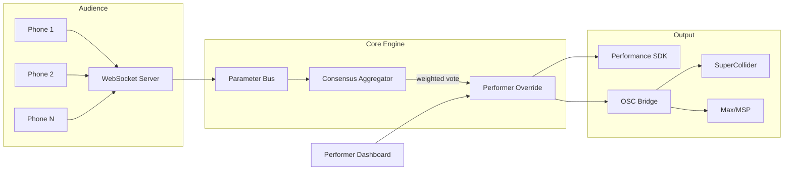

# Omni-Dromenon Machina

**Real-time audience-participatory performance system with weighted consensus algorithms**

[](https://github.com/omni-dromenon-machina/metasystem-master/actions)
[](./LICENSE)
[](./tsconfig.base.json)
[](./pnpm-workspace.yaml)

Omni-Dromenon enables collective audience control over live artistic performances. Audience inputs are spatially and temporally weighted through consensus algorithms, creating emergent group dynamics while preserving performer agency.

**Core innovation:** Performers maintain override authority while audiences shape the performance in real time - a democratic instrument for live art.

## Architecture



**P95 latency target: <2ms** from audience input to consensus output.

## Packages

| Package | Description | Language |
|---------|------------|----------|
| [`@omni-dromenon/core-engine`](./packages/core-engine) | WebSocket server, consensus algorithm, parameter bus | TypeScript |
| [`@omni-dromenon/performance-sdk`](./packages/performance-sdk) | React UI (performer dashboard + audience interface) | TypeScript/React |
| [`@omni-dromenon/client-sdk`](./packages/client-sdk) | WebSocket client library | TypeScript |
| [`@omni-dromenon/audio-synthesis-bridge`](./packages/audio-synthesis-bridge) | OSC gateway for external synthesizers | TypeScript |
| [`orchestrate`](./packages/orchestrate) | Multi-AI orchestration CLI | Python |

## Examples

| Example | Domain |
|---------|--------|
| [Generative Music](./examples/generative-music) | Real-time audience-driven music generation |
| [Generative Visual](./examples/generative-visual) | Shader-based visual art controlled by consensus |
| [Choreographic Interface](./examples/choreographic-interface) | Motion capture + pose detection |
| [Theatre Dialogue](./examples/theatre-dialogue) | Branching narrative driven by audience votes |

## Quick Start

```bash
# Clone and install
git clone https://github.com/omni-dromenon-machina/metasystem-master.git
cd metasystem-master
pnpm install

# Development
pnpm dev              # Start all packages in dev mode
pnpm build            # Build all TypeScript packages
pnpm test             # Run all tests

# Docker (full stack)
docker compose up     # Core engine + SDK + Redis + Nginx
```

### Single Package

```bash
# Core engine only
cd packages/core-engine
pnpm dev              # Hot reload with tsx
pnpm test             # Vitest
pnpm run test:bench   # Consensus latency benchmarks
```

## Project Structure

```
omni-dromenon-machina/
  .config/            Tooling configs (seed.yaml, metasystem.yaml)
  .github/            CI/CD, issue templates, community health
  docs/               Documentation (architecture, guides, specs, theory)
  examples/           Reference implementations (4 domains)
  infra/              Docker, GCP, nginx, static site
  packages/           Source code (pnpm workspaces)
  tools/              Build scripts, utilities
```

## Contributing

See [CONTRIBUTING.md](./.github/CONTRIBUTING.md) for guidelines. This project follows a phase-based development model - check [docs/plans/](./docs/plans/) for current priorities.

## License

[MIT](./LICENSE)
