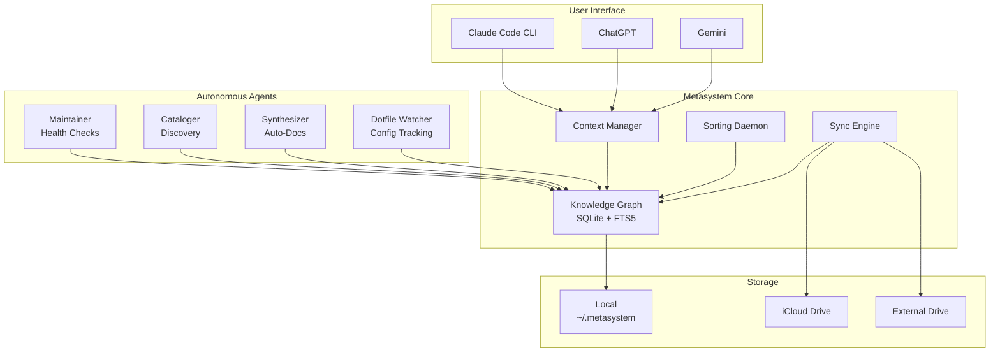
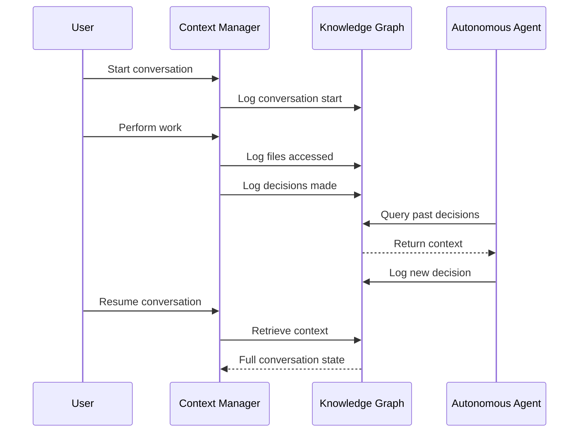

# Metasystem Core

**A self-maintaining knowledge graph system that never loses context**

Metasystem Core is a perpetual automation system that organizes your entire development environment, tracks every decision, and maintains itself autonomously. Built to solve the problem of context loss across AI conversations and machines.

---

## 🎯 What It Does

**The Problem**: You've built systems before, but they always bit-rot. Context gets lost between AI sessions. You rebuild the same thing 10+ times.

**The Solution**: A self-maintaining system that:
- ✅ **Never loses context** - Full conversation history in knowledge graph
- ✅ **Maintains itself** - Daily health checks, auto-repair, continuous discovery
- ✅ **Syncs everywhere** - Works across multiple machines via iCloud + external drive
- ✅ **Learns from past work** - Queries past decisions before starting new work
- ✅ **Manages dotfiles** - Secure configuration management with change tracking
- ✅ **Auto-generates docs** - System documentation always current

---

## 🚀 Quick Start

### Prerequisites

- macOS (tested on Sonoma/Sequoia)
- Python 3.10+
- Homebrew
- 1Password CLI (optional, for secret management)
- iCloud Drive enabled (optional, for sync)

### 1. Install

```bash
cd /Users/4jp/Workspace/metasystem-core
python3 -m venv .venv
source .venv/bin/activate
pip install -r requirements.txt
```

### 2. Initialize Knowledge Graph

```bash
# Discover all your projects
python3 discovery_engine.py discover

# Output: Found 69 projects, 60 tools
```

### 3. Start Background Services

```bash
# Load LaunchAgents (auto-start on boot)
launchctl load ~/Library/LaunchAgents/com.metasystem.sorting-daemon.plist
launchctl load ~/Library/LaunchAgents/com.metasystem.sync-daemon.plist
launchctl load ~/Library/LaunchAgents/com.metasystem.maintenance-daemon.plist

# Verify running
launchctl list | grep metasystem
```

### 4. Test It Works

```bash
# Run health checks
python3 agents/maintainer.py

# Query your projects
python3 knowledge_graph.py search --query="typescript" --type=project

# Check dotfile changes
python3 agents/dotfile_watcher.py query --days=7
```

**That's it!** The system now runs autonomously at 2 AM daily.

---

## 📚 Core Components

### 1. Knowledge Graph (`knowledge_graph.py`)

SQLite + FTS5 database that tracks everything:
- **Projects**: All workspace projects with tech stack
- **Files**: Organized files from sorting daemon
- **Conversations**: Claude/ChatGPT/Gemini sessions
- **Decisions**: Architectural choices logged
- **Tools**: Installed software and configs
- **Dotfiles**: Chezmoi-managed configuration files

**Query anything**:
```bash
python3 knowledge_graph.py search --query="react" --type=project
python3 knowledge_graph.py search --query="authentication" --type=decision
```

### 2. Autonomous Agents

**Maintainer** (`agents/maintainer.py`) - System health
- Database integrity checks
- Orphaned entity cleanup
- Disk space monitoring
- LaunchAgent status verification
- Auto-repair capabilities

**Cataloger** (`agents/cataloger.py`) - Continuous discovery
- Scans workspace for `seed.yaml` files
- Detects new tools (Homebrew, npm)
- Tracks changes via SHA256 hash
- Incremental updates only

**Synthesizer** (`agents/synthesizer.py`) - Auto-documentation
- Generates 7 markdown documents from knowledge graph
- Creates mermaid architecture diagrams
- Builds quick start guides
- Only regenerates when changes detected

**Dotfile Watcher** (`agents/dotfile_watcher.py`) - Configuration tracking
- Tracks all 30 chezmoi-managed dotfiles
- Monitors changes via git log
- Creates searchable history
- Enables queries like "what changed this week?"

### 3. Background Daemons

**Sorting Daemon** (every 5 min)
- Organizes Downloads folder
- Categorizes files by type
- Moves to appropriate locations
- Logs all movements to knowledge graph

**Sync Daemon** (every 5 min)
- Syncs knowledge graph to iCloud Drive
- Syncs to external drive when mounted
- Conflict resolution (newest wins)
- Automatic backup creation

**Maintenance Daemon** (daily at 2 AM)
- Runs health checks
- Discovers new projects/tools
- Tracks dotfile changes
- Syncs chezmoi state
- Regenerates documentation

### 4. Context Manager (`context_manager.py`)

Solves context loss problem:
- Logs all conversation starts
- Tracks files accessed during work
- Records architectural decisions
- Enables resuming previous sessions

**Never lose context again**:
```bash
# Start new conversation
python3 context_manager.py start

# Resume previous conversation
python3 context_manager.py recent
python3 context_manager.py resume --conv-id=<ID>

# Search past decisions
python3 context_manager.py search --query="architecture"
```

### 5. Discovery Engine (`discovery_engine.py`)

Auto-discovers your workspace:
- Finds projects with `seed.yaml` files
- Extracts tech stack, dependencies
- Detects installed tools
- Creates knowledge graph entities

**Runs automatically**, but can trigger manually:
```bash
python3 discovery_engine.py discover
python3 discovery_engine.py scan-tools
```

### 6. Multi-Machine Sync (`sync_engine.py`)

Seamless work across machines:
- SHA256-based change detection
- Bidirectional sync (local ↔ iCloud ↔ external)
- Conflict resolution with backups
- Automatic integrity verification

**Sync Status**:
```bash
python3 sync_engine.py status
python3 sync_engine.py sync
python3 sync_engine.py verify
```

### 7. Chezmoi Integration

Secure dotfile management:
- **No secrets in git** - 1Password integration
- **Change tracking** - Full git history
- **Multi-machine sync** - Via iCloud Drive
- **Query changes** - "What dotfiles changed?"

**Security Features**:
- GitHub auth via gh CLI (not plaintext tokens)
- AWS credentials from 1Password
- Automatic state backup

---

## 🗂️ Directory Structure

```
metasystem-core/
├── knowledge_graph.py          # Core KG with SQLite + FTS5
├── context_manager.py          # Conversation persistence
├── discovery_engine.py         # Project/tool discovery
├── sync_engine.py              # Multi-machine sync
├── sync_chezmoi.py             # Dotfile state sync
├── sorting_daemon.py           # File organization
├── maintenance_daemon.py       # Master orchestrator
├── documentation_generator.py  # Auto-doc generation
├── agents/                     # Autonomous agents
│   ├── maintainer.py          # Health checks + repair
│   ├── cataloger.py           # Continuous discovery
│   ├── synthesizer.py         # Documentation generation
│   └── dotfile_watcher.py     # Dotfile tracking
└── requirements.txt           # Python dependencies

~/.metasystem/
├── metastore.db               # Knowledge graph database
├── sorting-rules.yaml         # File organization rules
├── cataloger-state.json       # Discovery state
└── logs/                      # All daemon logs

~/Library/LaunchAgents/
├── com.metasystem.sorting-daemon.plist
├── com.metasystem.sync-daemon.plist
└── com.metasystem.maintenance-daemon.plist

~/Documents/                   # Auto-generated docs
├── WORKSPACE-INDEX.md
├── DECISIONS.md
├── TOOLS-INDEX.md
├── METASYSTEM-MAP.md
├── WORKFLOWS.md
├── ARCHITECTURE.md
└── QUICK-START.md
```

---

## 📖 Common Workflows

### Starting a New Project

```bash
# 1. Create project with seed.yaml
mkdir ~/Workspace/my-project
cd ~/Workspace/my-project
cat > seed.yaml <<EOF
name: my-project
tech_stack:
  backend: python
  frontend: react
  database: postgresql
EOF

# 2. Discovery will find it within 5 minutes (cataloger daemon)
# Or trigger manually:
python3 agents/cataloger.py scan

# 3. Query it
python3 knowledge_graph.py search --query="my-project"
```

### Resuming Previous Work

```bash
# Find recent conversations
python3 context_manager.py recent

# Resume specific conversation
python3 context_manager.py resume --conv-id=abc123...

# Search past decisions
python3 context_manager.py search --query="authentication"
```

### Checking System Health

```bash
# Manual health check
python3 agents/maintainer.py

# Check-only (no auto-repair)
python3 agents/maintainer.py --no-repair

# View maintenance logs
tail -f ~/.metasystem/logs/maintenance-daemon.log
```

### Querying Dotfile Changes

```bash
# What changed this week?
python3 agents/dotfile_watcher.py query --days=7

# Generate report
python3 agents/dotfile_watcher.py report --days=30 --output ~/dotfile-report.md

# Sync dotfiles to KG
python3 agents/dotfile_watcher.py sync
```

### Managing Sync

```bash
# Check sync status
python3 sync_engine.py status

# Manual sync
python3 sync_engine.py sync

# Verify database integrity
python3 sync_engine.py verify

# Sync chezmoi state
python3 sync_chezmoi.py sync
```

### Viewing Documentation

All auto-generated documentation is in `~/Documents/`:

- **WORKSPACE-INDEX.md** - Complete project catalog
- **DECISIONS.md** - Architectural decisions log
- **TOOLS-INDEX.md** - Installed tools registry
- **METASYSTEM-MAP.md** - System overview
- **WORKFLOWS.md** - Common workflows
- **ARCHITECTURE.md** - Component diagrams
- **QUICK-START.md** - Setup guide

Regenerated automatically when changes detected.

---

## 🔧 Configuration

### Sorting Rules (`~/.metasystem/sorting-rules.yaml`)

Customize file organization:

```yaml
rules:
  - pattern: "*.pdf"
    destination: "~/Documents/PDFs/{year}/{month}"

  - pattern: "Screenshot*.png"
    destination: "~/Pictures/Screenshots/{year}/{month}"

  - pattern: "*.mp4"
    destination: "~/Movies/Captures"
```

### Maintenance Schedule

Edit LaunchAgent to change timing:

```bash
# Edit maintenance schedule (default: 2 AM daily)
nano ~/Library/LaunchAgents/com.metasystem.maintenance-daemon.plist

# Change hour:
<key>Hour</key>
<integer>4</integer>  <!-- 4 AM instead -->

# Reload
launchctl unload ~/Library/LaunchAgents/com.metasystem.maintenance-daemon.plist
launchctl load ~/Library/LaunchAgents/com.metasystem.maintenance-daemon.plist
```

### Sync Locations

Configure in `sync_engine.py`:

```python
# Default locations
local_path = "~/.metasystem"
icloud_path = "~/Library/Mobile Documents/com~apple~CloudDocs/.metasystem"
external_path = "/Volumes/4444-iivii/.metasystem"

# Conflict resolution strategies
conflict_strategy = "newest"  # or "local", "remote", "manual"
```

---

## 🐛 Troubleshooting

### Sorting Daemon Not Running

```bash
# Check status
launchctl list | grep sorting-daemon

# View logs
tail -f ~/.metasystem/logs/sorting-daemon.log

# Restart
launchctl unload ~/Library/LaunchAgents/com.metasystem.sorting-daemon.plist
launchctl load ~/Library/LaunchAgents/com.metasystem.sorting-daemon.plist
```

### Database Issues

```bash
# Verify integrity
python3 sync_engine.py verify

# Health check with auto-repair
python3 agents/maintainer.py

# Manual database check
sqlite3 ~/.metasystem/metastore.db "PRAGMA integrity_check"
```

### Sync Not Working

```bash
# Check sync status
python3 sync_engine.py status

# Manual sync
python3 sync_engine.py sync

# Check for conflicts
ls -la ~/.metasystem/*.backup-*

# View sync logs
tail -f ~/.metasystem/logs/sync-daemon.log
```

### Context Not Persisting

```bash
# Verify conversation was created
python3 context_manager.py recent

# Check database
python3 knowledge_graph.py search --type=conversation

# Manually log decision
python3 context_manager.py log-decision \
  --decision="Your decision" \
  --rationale="Your rationale"
```

### Chezmoi Errors

```bash
# Check what changed
chezmoi diff

# Dry-run before applying
chezmoi apply --dry-run

# View chezmoi logs
chezmoi doctor

# Verify no secrets exposed
grep -r "ghp_\|aws_secret" ~/.config ~/.local/share/chezmoi
```

---

## 📊 Statistics

**Current System State**:
- **Projects**: 69 discovered
- **Tools**: 60 tracked
- **Dotfiles**: 30 managed
- **Entities in KG**: 251+
- **Documentation**: 7 auto-generated files
- **Daemons**: 3 running (sorting, sync, maintenance)

**Maintenance Schedule**:
- Sorting: Every 5 minutes
- Sync: Every 5 minutes
- Maintenance: Daily at 2 AM

**Disk Usage**:
- Knowledge graph: ~250 KB
- iCloud backup: ~250 KB
- Chezmoi backup: ~5 MB (158 files)

---

## 🏗️ Architecture

### Component Diagram



### Data Flow



---

## 🎓 Philosophy

**Why This Exists**:
- You've rebuilt systems 10+ times
- Context gets lost between AI sessions
- Work doesn't persist across machines
- Past decisions are forgotten
- Documentation becomes stale

**Core Principles**:

1. **Single Source of Truth** - Knowledge graph is the anchor
2. **Self-Maintaining** - System maintains itself autonomously
3. **Incremental Value** - Each phase delivers standalone value
4. **Simple Technologies** - SQLite, Python, YAML (easy to modify)
5. **Offline-First** - Works without network
6. **Observable** - Logs, metrics, always see what's happening

**Design Decisions**:

- **SQLite over Postgres** - Simpler, portable, no server needed
- **Git for dotfiles** - Version control built-in, proven tool
- **LaunchAgents over cron** - macOS native, better error handling
- **iCloud over Dropbox** - Native macOS integration
- **Python over Rust** - Easier to modify, good enough performance

---

## 🔐 Security

**Secrets Management**:
- ✅ No secrets in git repositories
- ✅ No plaintext tokens on disk
- ✅ 1Password CLI for secret retrieval
- ✅ macOS Keychain for GitHub auth
- ✅ Secure template rendering

**Security Features**:
- GitHub authentication via gh CLI (not plaintext tokens)
- AWS credentials from 1Password (not in dotfiles)
- Automatic `.backup-*` creation before overwrites
- SHA256 integrity verification for synced files
- No credentials in knowledge graph

**Audit Trail**:
- Every file movement logged
- Every dotfile change tracked
- Every decision recorded
- Full git history for chezmoi

---

## 🚀 Future Enhancements

**Potential Additions** (not in current plan):
- Web UI for knowledge graph exploration
- VS Code extension for context integration
- Mobile app for on-the-go queries
- Integration with more AI tools (Cursor, etc.)
- Automated test generation
- Performance profiling integration
- Docker support for non-macOS
- Plugin system for custom agents

---

## 📝 Contributing

This is a personal system, but principles are reusable:

1. **Fork and adapt** - Take what works for you
2. **Share learnings** - Blog about your improvements
3. **Report bugs** - Open issues for problems found
4. **Suggest features** - Ideas welcome via issues

---

## 📄 License

MIT License - Use freely, no warranties

---

## 🙏 Acknowledgments

**Built With**:
- Claude 3.5 Sonnet (architecture + implementation)
- SQLite (knowledge graph storage)
- chezmoi (dotfile management)
- 1Password CLI (secrets management)
- macOS LaunchAgents (background services)

**Inspired By**:
- Memex (Vannevar Bush)
- Zettelkasten method
- Personal knowledge management systems
- DevOps automation principles

---

## 📚 Learn More

**Phase Completion Documents**:
- [Phase 1: Knowledge Graph](/Users/4jp/PHASE_1_COMPLETE.md)
- [Phase 2: Context Management](/Users/4jp/PHASE_2_COMPLETE.md)
- [Phase 3: File Organization](/Users/4jp/PHASE_3_COMPLETE.md)
- [Phase 4: Agent Learning](/Users/4jp/PHASE_4_COMPLETE.md)
- [Phase 5: Multi-Machine Sync](/Users/4jp/PHASE_5_COMPLETE.md)
- [Phase 6: Self-Maintenance](/Users/4jp/PHASE_6_COMPLETE.md)
- [Phase 7: Chezmoi Enhancement](/Users/4jp/PHASE_7_COMPLETE.md)

**Auto-Generated Docs**:
- [~/Documents/WORKSPACE-INDEX.md](/Users/4jp/Documents/WORKSPACE-INDEX.md)
- [~/Documents/ARCHITECTURE.md](/Users/4jp/Documents/ARCHITECTURE.md)
- [~/Documents/QUICK-START.md](/Users/4jp/Documents/QUICK-START.md)

---

**Questions?** Check the troubleshooting section or review the phase completion documents.

**The system that maintains itself.** 🎉
